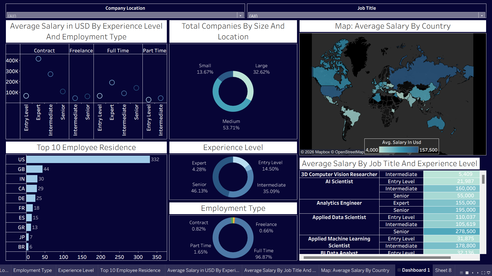
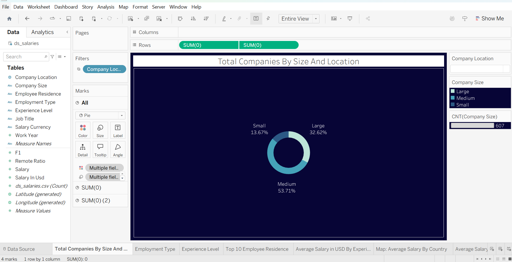
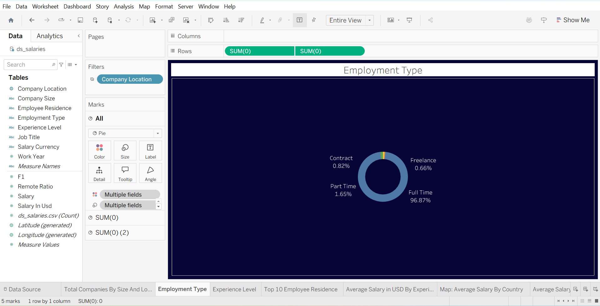
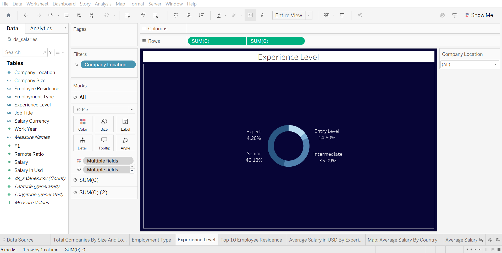
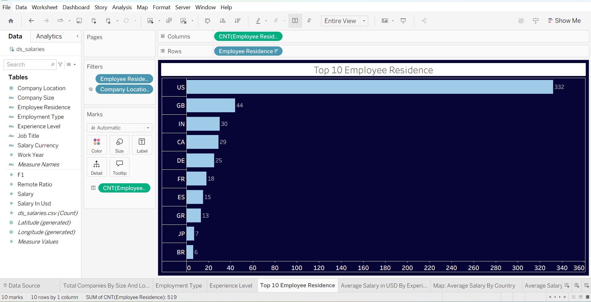
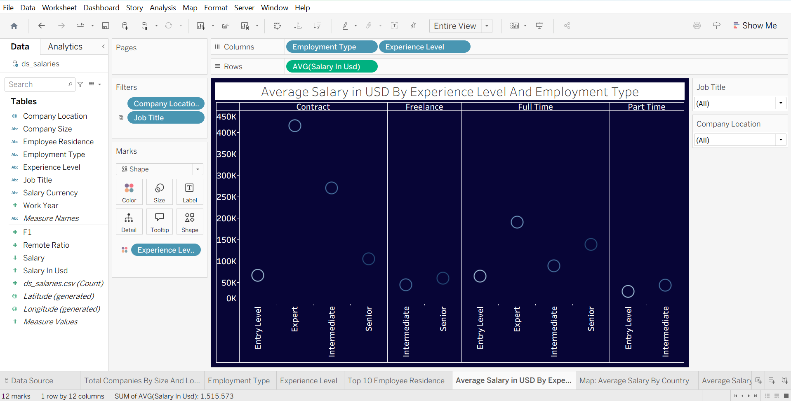
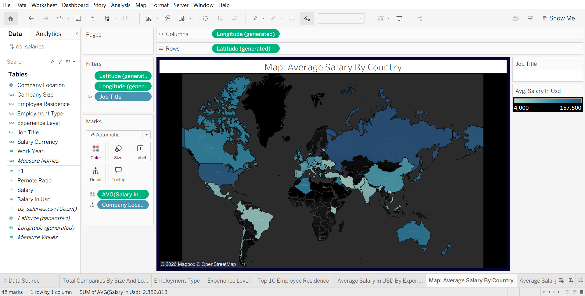
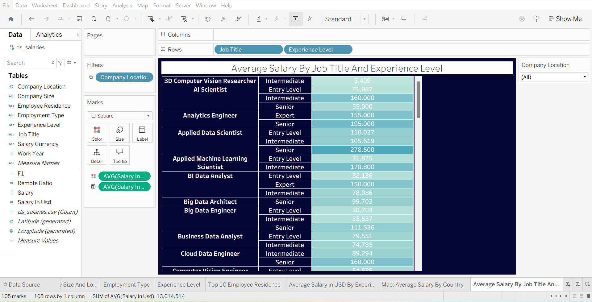

# Data Science Job Salaries Dashboard

**A comprehensive Tableau dashboard analyzing Data Science job salaries worldwide (2020–2022)**

## 📋 Project Overview

This project explores salary trends in the Data Science and related fields using a real-world dataset of 607 job records. The interactive Tableau dashboard provides deep insights into how experience level, job title, company size, location, and employment type affect salaries.

**Key Focus Areas:**
- Salary distribution by experience level and job title
- Geographic salary variations across countries
- Impact of company size and employment type
- Trends from 2020 to 2022

## 🗂️ Dataset

- **File:** `ds_salaries.csv`
- **Rows:** 607
- **Years:** 2020–2022

- **Direct Download:**  
  👉 [Download ds_salaries.csv](https://raw.githubusercontent.com/wisemansg/tableau/main/assets/ds_salaries.csv)

- **View on GitHub:**  
  👉 [assets/ds_salaries.csv](https://github.com/wisemansg/tableau/blob/main/assets/ds_salaries.csv)

## 📊 Visualizations

### Individual Sheets

**Figure 1:**  

**Figure 2:**  

**Figure 3:**  

**Figure 4:**  

**Figure 5:**  

**Figure 6:**  

**Figure 7:**  

### Final Dashboard

**Figure 8:** Complete Interactive Dashboard  

## 🔍 Key Insights

- Salaries increased significantly in 2022 compared to previous years.
- The United States dominates both the number of jobs and highest salary ranges.
- Senior (SE) and Expert (EX) roles earn substantially more than Entry and Mid-level roles.
- Large and Medium companies represent the majority of the dataset.
- Full-time employment is dominant (96.87% of records).

## 🛠️ Tools & Technologies

- **Tableau Desktop** – Dashboard creation and visualization
- **Data Preparation:** Tableau + Excel
- **Dataset:** Public Data Science Salaries CSV
